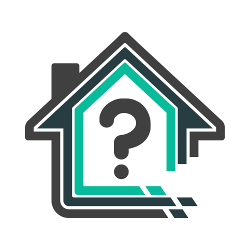

<a name="readme-top"></a>

<!-- PROJECT SHIELDS -->
[![Contributors][contributors-shield]][contributors-url]
[![Forks][forks-shield]][forks-url]
[![Stargazers][stars-shield]][stars-url]
[![Issues][issues-shield]][issues-url]
[![GPL-3.0 License][license-shield]][license-url]


<!-- PROJECT LOGO -->
<br />
<div align="center">
  <a href="https://github.com/DartLazer/WhoIsHomeUI">
    
  </a>

<h3 align="center">WhoIsHomeUI</h3>

  <p align="center">
    A webapp that scans your network and allows you to track hosts, give email & discord updates and <strong>now also curfew notifications to check if your kids are online at night</strong>!
    <br />
    <br />
    <a href="https://github.com/DartLazer/WhoIsHomeUI/issues">Report Bug</a>
    ·
    <a href="https://github.com/DartLazer/WhoIsHomeUI/issues">Request Feature</a>
  </p>
</div>


<!-- TABLE OF CONTENTS -->
<details>
  <summary>Table of Contents</summary>
  <ol>
    <li>
      <a href="#about-the-project">About The Project</a>
      <ul>
        <li><a href="#built-with">Built With</a></li>
      </ul>
    </li>
    <li>
      <a href="#getting-started">Getting Started</a>
      <ul>
        <li><a href="#prerequisites">Prerequisites</a></li>
        <li><a href="#installation">Installation</a></li>
        <li><a href="#update">Update</a></li>
        <li><a href="#enabling-on-system-boot">Enabling on system boot</a></li>
      </ul>
    </li>
    <li><a href="#usage">Usage</a></li>
    <li><a href="#roadmap">Roadmap</a></li>
    <li><a href="#contributing">Contributing</a></li>
    <li><a href="#license">License</a></li>
    <li><a href="#contact">Contact</a></li>
    <li><a href="#acknowledgments">Acknowledgments</a></li>
  </ol>
</details>


<!-- ABOUT THE PROJECT -->

## About The Project

[![WhoIsHomeUI Screen Shot][product-screenshot]](https://github.com/DartLazer/WhoIsHomeUI)

WhoIsHomeUI is a webapp that scans your network and allows you to track hosts, give email and discord updates, see new
MAC addresses who connect to your network and check if your kids access the internet at night with the new curfew
monitoring!

The webapp runs on Django and the network scanning is done by the linux tool arp-scan. (for the cli email alert version
check: https://github.com/DartLazer/WhoIsHome)
This project started as a way for me to learn Python and Django a while back. After a few friends liked my tool I
decided to put it on here for everyone to use. If you have any comments, tips on my coding, or feature requests. Please
open an issue and I will see to it.

WhoIsHomeUI scans devices on your network using ARP-Scan. It keeps track of all hosts, based on MAC Addresses in a
database.
The system registers a device "away from home" when it misses a certain amount of scans. The "not home threshold". I
would recommend leaving this at around 20, since Apple devices tend to disconnect from the network a lot to save battery
power. Lowering this value will cause a lot of false departures from Apple devices.


> At the tool's current state the Django server is ran in Debug mode with the development webserver. I do therefore ***
> NOT*** recommend running this on an open port to the Internet. In a future update I will probably ship this with a
> proper webserver, depending on how much people will actually use the service.

<p align="right">(<a href="#readme-top">back to top</a>)</p>

### Built With

* [![Django][Django.com]][Django-url]
* [![Bootstrap][Bootstrap.com]][Bootstrap-url]
* [![Sqlite][Sqlite.com]][Sqlite-url]

<p align="right">(<a href="#readme-top">back to top</a>)</p>


<!-- GETTING STARTED -->

## Getting Started

These are the steps to setup the project on your system

### Prerequisites

- First install Docker and Docker Compose on your Raspberry Pi (or other similar device, hereafter referenced to as
  raspberry pi) following the link upto and including step 6:
  https://dev.to/elalemanyo/how-to-install-docker-and-docker-compose-on-raspberry-pi-1mo
- Next install git on your raspberry Pi (or other similar device, hereafter referenced to as raspberry pi)
  https://www.geeksforgeeks.org/how-to-install-git-on-raspberry-pi/

### Installation

1. Git clone this repo to your raspberry pi
    ```sh
    git clone https://github.com/DartLazer/WhoIsHomeUI
    ```
2. To start the application on a **different port** than the default port 8000 edit the file `.env` using nano or any
   other editor and change the value for __WHOIH_PORT__
   > WHOIH_PORT=**8000**<br/>
   > WHOIH_TZ=Europe/Amsterdam

3. To **change the timezone** edit the file `.env` using nano or any other editor and change the value for __WHOIH_TZ__
   > WHOIH_PORT=8000<br/>
   > WHOIH_TZ=**Europe/Amsterdam**
   >

   Timezone format from table TZ database name from https://en.m.wikipedia.org/wiki/List_of_tz_database_time_zones

4. In the cloned folder execute the following command to start
    ```sh
    docker-compose up -d
    ```
5. The container should now be up and running on your
    ```sh
    your_raspberrypi_ip_address:8000
    ```
6. In your webbrowser go to
    ```sh
    http://your_rasppberrypi_ip_address:8000/
    ```

<p align="right">(<a href="#readme-top">back to top</a>)</p>

### Update

Unless otherwise stated in the changelog section **Update Instructions**

- In the folder containing whoishomeui: `git pull`
- Then the following command `docker-compose up -d --build` (if this does not work try adding sudo in front)
- That should be it!

<p align="right">(<a href="#readme-top">back to top</a>)</p>

#### For migrating from v0.23 to v0.3 use the below steps

- Migration of the database file will lead to having to manually restore the database.
- Open a terminal in the root folder of your WhoIsHomeUI installation.
- Backup the current db just to be sure `cp mysite/db.sqlite3 db_backup.sqlite3`
- Run:

```sh
docker-compose down && git pull && docker-compose build
```

- Run:

```bash
docker container create --name dummy -v whoishomeui_dbstore:/mnt/test hello-world
docker cp WhoIsHomeUIDjango/db.sqlite3 dummy:/mnt/test/db.sqlite3
docker rm dummy
```

(this will create the docker volume required, put your old database in it, and remove the dummy container)

- Run:

```sh
docker-compose up -d
```

- Upgrade to version 0.3 is now complete.

<p align="right">(<a href="#readme-top">back to top</a>)</p>

#### Backing up the database after the 0.3 upgrade

- Get the container name using `docker ps`
- run the following command

```bash 
docker cp <container_name>:/dbstore/db.sqlite3 /local_pc_path/db_backup.sqlite3
```

<p align="right">(<a href="#readme-top">back to top</a>)</p>

### Enabling on system boot

To enable WhoIsHomeUI to run on system boot we'll add a command to crontab to execute the docker-compose up -d command
at system boot.

- Note the installation of your WhoIsHomeUI installation (use `pwd` command in the installation directory)
- On your raspberry pi enter the following command (If it asks you which editor to use just use your preffered one)

```sh
sudo crontab -e
``` 

- Hold the down arrow key until you reach the end of the comments block and enter the following code

```sh
@reboot docker-compose -f directory_from_first_step/docker-compose.yml up -d
```

That's it!

<p align="right">(<a href="#readme-top">back to top</a>)</p>

<!-- USAGE EXAMPLES -->

## Usage

- Go to the settings page and go to the Scanner Settings section:
- Not Home Threshold (The amount of scans a device has to miss, to be considered to have left home). I would recommend
  leaving this to around 20. iPhones tend to disconnect sometimes. Leaving this on a lower value will register a lot of
  disconnects from Apple devices.
- Internet interface should be: "eth0" for a wired ethernet connection. If your raspberry pi is using wifi use "wlp2s0"
  or type "ifconfig" in command line to get the active interface name.
- IP Subnet: change this to the net your router uses. for me it uses `192.168.2.1 - 192.168.2.198` so set here ONLY
  192.168.2. (dont forget last dot)
- IP range start (first IP to scan within earlier specified range)
- IP range end (last IP to scan within earlier specified range).
- Press SAVE. Let the page reload and now enable the scanner
- **Now supports Discord Notifications as well**. Setup at the settings page! (<a href="https://support.discord.com/hc/en-us/articles/228383668-Intro-to-Webhooks">Click here for
  instructions on how to setup the discord webhook</a>)
- If you want email notifications set up email settings as well.
- In the email body and subject you can access the following variables by putting them in curly brackets {}
- target (gives target name), arrival_time, departure_time , time_away, time_home.

- Go to `your_raspberrypi_ip_addres:8000/settings/`

- Enable scanner status and you should be up and running!

<p align="right">(<a href="#readme-top">back to top</a>)</p>

### Curfew Mode

To enable curfew mode to i.e. check if your kids are online during certain times do the following:

- Select the hosts from the front page which you want tracked during curfew times, and enable curfew mode.
- Go to the settings page
- Press app settings
- Enable curfew mode
- Enter the curfew times
- (Maybe also lock the app with a password)
- Setup e-mail notifications and/or discord
  notifications. (<a href="https://support.discord.com/hc/en-us/articles/228383668-Intro-to-Webhooks">Click here for
  instructions on how to setup the discord webhook</a>)

<!-- ROADMAP -->

## Roadmap

- [x] Build an awesome project
- [ ] DockerHub Publish

See the [open issues](https://github.com/DartLazer/WhoIsHomeUI/issues) for a full list of proposed features (and known
issues).

<p align="right">(<a href="#readme-top">back to top</a>)</p>


<!-- CONTRIBUTING -->

## Contributing

Contributions are what make the open source community such an amazing place to learn, inspire, and create. Any
contributions you make are **greatly appreciated**.

If you have a suggestion that would make this better, please fork the repo and create a pull request. You can also
simply open an issue with the tag "enhancement".
Don't forget to give the project a star! Thanks again!

1. Fork the Project
2. Create your Feature Branch (`git checkout -b feature/AmazingFeature`)
3. Commit your Changes (`git commit -m 'Add some AmazingFeature'`)
4. Push to the Branch (`git push origin feature/AmazingFeature`)
5. Open a Pull Request

<p align="right">(<a href="#readme-top">back to top</a>)</p>


<!-- LICENSE -->

## License

Distributed under the GPL-3.0 License. See `LICENSE` for more information.

<p align="right">(<a href="#readme-top">back to top</a>)</p>


<!-- CONTACT -->

## Contact

Rik - [Github](https://github.com/DartLazer)

Project Link: [https://github.com/DartLazer/WhoIsHomeUI](https://github.com/DartLazer/WhoIsHomeUI)

<p align="right">(<a href="#readme-top">back to top</a>)</p>


<!-- ACKNOWLEDGMENTS -->

## Acknowledgments

* [django project](https://pypi.org/project/Django/)
* [django-crispy-forms](https://pypi.org/project/django-crispy-forms/)
* [django-background-tasks](https://pypi.org/project/django4-background-tasks/)
* [discord.py](https://pypi.org/project/discord.py/)
* [bootstrap](https://getbootstrap.com)

<p align="right">(<a href="#readme-top">back to top</a>)</p>


<!-- MARKDOWN LINKS & IMAGES -->
<!-- https://www.markdownguide.org/basic-syntax/#reference-style-links -->

[contributors-shield]: https://img.shields.io/github/contributors/DartLazer/WhoIsHomeUI.svg?style=for-the-badge

[contributors-url]: https://github.com/DartLazer/WhoIsHomeUI/graphs/contributors

[forks-shield]: https://img.shields.io/github/forks/DartLazer/WhoIsHomeUI.svg?style=for-the-badge

[forks-url]: https://github.com/DartLazer/WhoIsHomeUI/network/members

[stars-shield]: https://img.shields.io/github/stars/DartLazer/WhoIsHomeUI.svg?style=for-the-badge

[stars-url]: https://github.com/DartLazer/WhoIsHomeUI/stargazers

[issues-shield]: https://img.shields.io/github/issues/DartLazer/WhoIsHomeUI.svg?style=for-the-badge

[issues-url]: https://github.com/DartLazer/WhoIsHomeUI/issues

[license-shield]: https://img.shields.io/github/license/DartLazer/WhoIsHomeUI.svg?style=for-the-badge

[license-url]: https://github.com/DartLazer/WhoIsHomeUI/blob/master/LICENSE.txt

[product-screenshot]: screenshots/readme_screenshot.png

[Bootstrap.com]: https://img.shields.io/badge/Bootstrap-563D7C?style=for-the-badge&logo=bootstrap&logoColor=white

[Bootstrap-url]: https://getbootstrap.com

[Django.com]: https://img.shields.io/badge/django-%23092E20.svg?style=for-the-badge&logo=django&logoColor=white

[Django-url]: http://djangoproject.com

[Sqlite.com]: https://img.shields.io/badge/sqlite-%2307405e.svg?style=for-the-badge&logo=sqlite&logoColor=white

[Sqlite-url]: https://www.sqlite.org